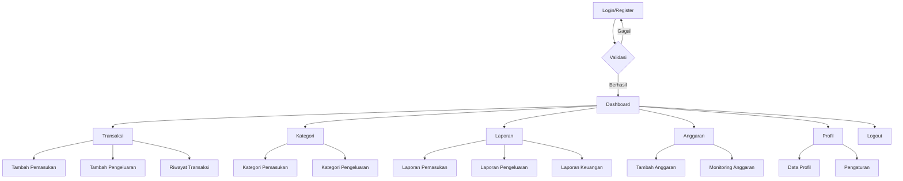
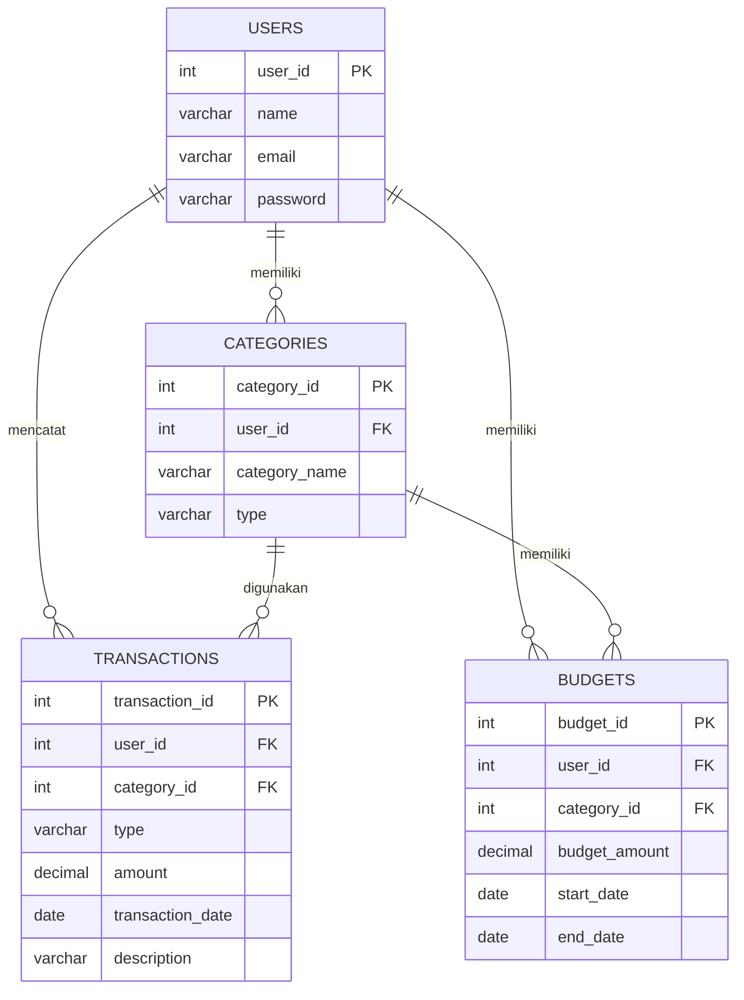

# PERANCANGAN APLIKASI MANAJEMEN KEUANGAN (FINANCE TRACKING)

## 1. Deskripsi Sistem

Aplikasi Manajemen Keuangan (Finance Tracking) merupakan aplikasi yang digunakan untuk membantu pengguna dalam mencatat, mengelola, dan memantau kondisi keuangan secara terstruktur. Aplikasi dapat digunakan untuk mencatat pemasukan, pengeluaran, kategori transaksi, serta melihat ringkasan dan laporan keuangan.

Sistem menyediakan fitur pencatatan transaksi, pengelolaan kategori, pemantauan saldo, riwayat transaksi, dan laporan keuangan sehingga pengguna dapat mengetahui kondisi keuangan berdasarkan data yang telah dicatat.

---

# 2. Hirarki Menu Aplikasi

## A. User

- **Dashboard**
  - Total Saldo
  - Total Pemasukan
  - Total Pengeluaran
  - Ringkasan Keuangan
- **Transaksi**
  - Tambah Pemasukan
  - Tambah Pengeluaran
  - Riwayat Transaksi
- **Kategori**
  - Kategori Pemasukan
  - Kategori Pengeluaran
- **Laporan**
  - Laporan Pemasukan
  - Laporan Pengeluaran
  - Laporan Keuangan
- **Anggaran**
  - Daftar Anggaran
  - Tambah Anggaran
  - Monitoring Anggaran
- **Profil**
  - Data Profil
  - Pengaturan
- **Logout**

---

# 3. User Flow Aplikasi



---

# 4. Konsep ER-D Sederhana

Entitas utama yang digunakan dalam aplikasi adalah:

- **users**: menyimpan data pengguna.
- **categories**: menyimpan kategori pemasukan dan pengeluaran.
- **transactions**: menyimpan transaksi keuangan.
- **budgets**: menyimpan data anggaran pengguna.



---

# 5. Design System

## 5.1 Color Palette

| Elemen | Warna |
|---|---|
| Primary | #2563EB |
| Secondary | #64748B |
| Success | #16A34A |
| Danger | #DC2626 |
| Warning | #F59E0B |
| Background | #F8FAFC |
| Text | #1E293B |
| White | #FFFFFF |

Warna hijau digunakan untuk menunjukkan pemasukan atau kondisi keuangan positif, sedangkan warna merah digunakan untuk menunjukkan pengeluaran.

## 5.2 Typography

Font yang digunakan adalah **Inter**.

| Style | Ukuran | Penggunaan |
|---|---:|---|
| Heading 1 | 24 px | Judul halaman |
| Heading 2 | 20 px | Subjudul |
| Heading 3 | 16 px | Judul Card |
| Body | 14 px | Isi informasi |
| Caption | 12 px | Keterangan |

## 5.3 Reusable Components

Komponen yang digunakan secara berulang:

- Button Primary
- Button Secondary
- Button Danger
- Form Input
- Dropdown
- Date Picker
- Card
- Table
- Badge
- Modal
- Sidebar
- Navbar
- Search
- Pagination
- Notification

---

# 6. Rancangan Halaman Dashboard

Dashboard digunakan untuk memberikan gambaran kondisi keuangan pengguna secara ringkas.

### Komponen Dashboard:

1. **Total Saldo**
2. **Total Pemasukan**
3. **Total Pengeluaran**
4. **Sisa Anggaran**
5. **Grafik Pemasukan dan Pengeluaran**
6. **Transaksi Terbaru**
7. **Ringkasan Pengeluaran berdasarkan Kategori**

### Gambaran Layout

```text
+-------------------------------------------------------+
| FINANCE TRACKING                    Profil ▼          |
+----------------+--------------------------------------+
| Dashboard      | Dashboard                            |
| Transaksi      |                                      |
| - Pemasukan    | +---------+ +---------+ +----------+ |
| - Pengeluaran  | |  Saldo  | |Pemasukan | |Pengeluaran| |
| - Riwayat      | +---------+ +---------+ +----------+ |
| Kategori       |                                      |
| Laporan        | +-------------------------------+   |
| Anggaran       | |  Grafik Keuangan             |   |
| Profil         | +-------------------------------+   |
| Logout         |                                      |
|                | +-------------------------------+   |
|                | | Transaksi Terbaru             |   |
|                | +-------------------------------+   |
+----------------+--------------------------------------+
```

---

# 7. Rancangan Halaman Transaksi

Halaman transaksi digunakan untuk mencatat pemasukan dan pengeluaran.

### Form Transaksi:

- Jenis Transaksi
  - Pemasukan
  - Pengeluaran
- Kategori
- Nominal
- Tanggal
- Keterangan
- Tombol Simpan

### Contoh Layout

```text
+---------------------------------------------+
| Tambah Transaksi                            |
+---------------------------------------------+
| Jenis       : [ Pemasukan ▼ ]               |
| Kategori    : [ Gaji ▼ ]                    |
| Nominal     : [ Rp 5.000.000 ]              |
| Tanggal     : [ 18/09/2026 ]                |
| Keterangan  : [ Gaji Bulanan ]              |
|                                             |
|              [ SIMPAN TRANSAKSI ]           |
+---------------------------------------------+
```

---

# 8. Rancangan Halaman Riwayat Transaksi

Halaman ini menampilkan seluruh transaksi yang telah dicatat pengguna.

| Tanggal | Kategori | Jenis | Nominal | Keterangan | Aksi |
|---|---|---|---:|---|---|
| 18/09/2026 | Gaji | Pemasukan | Rp5.000.000 | Gaji Bulanan | Edit/Hapus |
| 18/09/2026 | Makanan | Pengeluaran | Rp50.000 | Makan Siang | Edit/Hapus |
| 17/09/2026 | Transportasi | Pengeluaran | Rp30.000 | Transport | Edit/Hapus |

Fitur tambahan:

- Search transaksi
- Filter berdasarkan tanggal
- Filter berdasarkan kategori
- Filter pemasukan/pengeluaran
- Edit transaksi
- Hapus transaksi

---

# 9. Rancangan Halaman Laporan

Halaman laporan digunakan untuk melihat kondisi keuangan berdasarkan periode tertentu.

### Komponen:

- Filter tanggal/periode
- Total pemasukan
- Total pengeluaran
- Total saldo
- Grafik pemasukan dan pengeluaran
- Rekap berdasarkan kategori
- Tombol cetak/export laporan

Contoh:

```text
+-------------------------------------------------------+
| LAPORAN KEUANGAN                                      |
+-------------------------------------------------------+
| Periode: [ September 2026 ▼ ]                         |
|                                                       |
| Pemasukan      : Rp 8.000.000                         |
| Pengeluaran    : Rp 3.500.000                         |
| Saldo          : Rp 4.500.000                         |
|                                                       |
| +-----------------------------------------------+     |
| |       Grafik Pemasukan & Pengeluaran         |     |
| +-----------------------------------------------+     |
|                                                       |
| [ CETAK LAPORAN ]     [ EXPORT ]                     |
+-------------------------------------------------------+
```

---

# 10. Rancangan Halaman Anggaran

Halaman anggaran digunakan untuk menentukan batas pengeluaran berdasarkan kategori dan periode tertentu.

Contoh:

| Kategori | Anggaran | Pengeluaran | Sisa |
|---|---:|---:|---:|
| Makanan | Rp1.000.000 | Rp750.000 | Rp250.000 |
| Transportasi | Rp500.000 | Rp300.000 | Rp200.000 |
| Hiburan | Rp300.000 | Rp350.000 | -Rp50.000 |

Sistem dapat memberikan indikator ketika jumlah pengeluaran mendekati atau melebihi anggaran.

---

# 11. Link Project Figma

**Link publik project Figma:**

> [Masukkan link publik Figma di sini]

Contoh:

`https://www.figma.com/design/XXXXXXXX/Finance-Tracking`

Pengaturan akses Figma disarankan menggunakan **Anyone with the link can view** agar rancangan dapat dilihat oleh dosen atau penguji.

---

# 12. Hasil Rancangan Stitch/Figma

## Dashboard

> **[Tempel screenshot hasil rancangan Dashboard di sini]**

## Transaksi

> **[Tempel screenshot hasil rancangan halaman Transaksi di sini]**

## Riwayat Transaksi

> **[Tempel screenshot hasil rancangan Riwayat Transaksi di sini]**

## Laporan Keuangan

> **[Tempel screenshot hasil rancangan Laporan Keuangan di sini]**

## Anggaran

> **[Tempel screenshot hasil rancangan Anggaran di sini]**

---

# 13. Kesimpulan Perancangan

Perancangan Aplikasi Manajemen Keuangan (Finance Tracking) mencakup struktur menu, user flow, rancangan basis data menggunakan ER-D Mermaid, serta Design System dan rancangan antarmuka menggunakan Figma/Stitch. Perancangan ini digunakan sebagai dasar sebelum tahap implementasi sehingga pengembangan aplikasi memiliki struktur, alur, dan tampilan yang telah direncanakan.