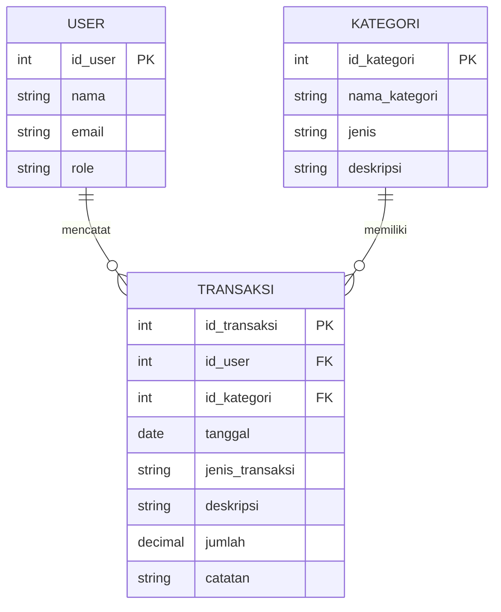

# Aplikasi Manajemen Keuangan (Finance Tracking)

## 1. Informasi Proyek

| Informasi | Keterangan |
|---|---|
| Mata Kuliah | Pemrograman Web 2 (Client-Side Programming) |
| Milestone | Milestone 1 – Perencanaan Menu & UI Wireframing |
| Topik | Aplikasi Manajemen Keuangan (Finance Tracking) |
| Jenis Sistem | Admin Panel / Back-Office berbasis Web |
| Konsep Visual | Glassmorphism |
| Teknologi Target | HTML5, CSS3, JavaScript |
| Sumber Data | Mock Data / Client-Side |

## 2. Deskripsi Sistem

Aplikasi Manajemen Keuangan (Finance Tracking) merupakan Admin Panel berbasis web yang dirancang untuk membantu pengguna dalam mencatat, mengelola, memantau, dan melihat ringkasan aktivitas keuangan.

Sistem berfokus pada pengelolaan data transaksi berupa pemasukan dan pengeluaran, pengelolaan kategori transaksi, serta penyajian laporan dan ringkasan kondisi keuangan dalam bentuk tabel, kartu informasi, dan grafik.

Pada tahap tugas ini, sistem berfokus pada sisi Client-Side sehingga belum memerlukan koneksi ke database server. Data yang digunakan dapat berupa mock data untuk kebutuhan demonstrasi antarmuka dan interaktivitas.

## 3. Tujuan Perancangan

Tujuan perancangan aplikasi adalah:

1. Membuat antarmuka Admin Panel Finance Tracking yang modern dan responsif.
2. Memudahkan pengguna dalam melihat ringkasan kondisi keuangan.
3. Memudahkan proses pencatatan pemasukan dan pengeluaran.
4. Memudahkan pencarian, penyaringan, dan pengelolaan data transaksi.
5. Menyediakan informasi keuangan melalui tabel, kartu ringkasan, dan grafik.
6. Menerapkan prinsip desain Glassmorphism secara konsisten pada antarmuka.

## 4. Target Pengguna

Pengguna utama sistem adalah:

- **Admin**: mengelola transaksi, kategori, laporan, dan pengaturan sistem.
- **Pengguna**: menggunakan dashboard untuk melihat ringkasan dan mengelola data keuangan sesuai kebutuhan sistem.

Pada implementasi Client-Side, hak akses dapat disimulasikan tanpa koneksi database.

## 5. Hirarki Menu / Sidebar

Struktur navigasi utama dirancang sebagai berikut:

```text
Finance Tracking
│
├── Dashboard
│
├── Transaksi
│   ├── Semua Transaksi
│   ├── Pemasukan
│   └── Pengeluaran
│
├── Kategori
│
├── Laporan Keuangan
│
├── Pengaturan
│
└── Logout
```

### 5.1 Penjelasan Menu

| Menu | Fungsi |
|---|---|
| Dashboard | Menampilkan ringkasan saldo, pemasukan, pengeluaran, grafik, dan transaksi terbaru. |
| Semua Transaksi | Menampilkan seluruh data transaksi dalam bentuk tabel. |
| Pemasukan | Menampilkan transaksi yang termasuk pemasukan. |
| Pengeluaran | Menampilkan transaksi yang termasuk pengeluaran. |
| Kategori | Mengelola kategori transaksi keuangan. |
| Laporan Keuangan | Menampilkan rekap dan visualisasi kondisi keuangan berdasarkan periode. |
| Pengaturan | Mengatur profil, preferensi tampilan, notifikasi, mata uang, dan keamanan akun. |
| Logout | Keluar dari sistem. |

## 6. User Flow

Alur penggunaan utama aplikasi:

```text
Login / Halaman Utama
        │
        ▼
    Dashboard
        │
        ├──────────────► Lihat Ringkasan Keuangan
        │
        ├──────────────► Transaksi
        │                    │
        │                    ├── Semua Transaksi
        │                    ├── Pemasukan
        │                    └── Pengeluaran
        │
        ├──────────────► Tambah Transaksi
        │                    │
        │                    ▼
        │              Isi Form Transaksi
        │                    │
        │                    ▼
        │              Validasi Data
        │                    │
        │                    ▼
        │              Simpan Transaksi
        │
        ├──────────────► Kategori
        │
        ├──────────────► Laporan Keuangan
        │
        └──────────────► Pengaturan
```

## 7. Konsep ER-D Sederhana

Entitas utama yang digunakan dalam perancangan:

- **User**: menyimpan informasi pengguna/admin.
- **Kategori**: menyimpan kategori transaksi.
- **Transaksi**: menyimpan data pemasukan dan pengeluaran.
- **Laporan**: representasi hasil rekap transaksi berdasarkan periode.

### 7.1 ER-D Mermaid.js



**Catatan:** Laporan tidak dibuat sebagai entitas penyimpanan utama karena pada tahap Client-Side laporan dapat dihasilkan dari rekap data transaksi berdasarkan periode, kategori, dan jenis transaksi.

## 8. Rancangan Halaman

### 8.1 Dashboard

Dashboard menjadi halaman utama setelah pengguna masuk ke sistem.

Komponen:

- Header dan sapaan pengguna.
- Search bar.
- Notification.
- Profile.
- Card Total Saldo.
- Card Total Pemasukan.
- Card Total Pengeluaran.
- Card Sisa Saldo.
- Grafik pemasukan dan pengeluaran.
- Grafik distribusi pengeluaran berdasarkan kategori.
- Tabel transaksi terbaru.
- Tombol Tambah Transaksi.

### 8.2 Data Transaksi

Halaman ini digunakan untuk melihat dan mengelola transaksi.

Komponen:

- Judul halaman.
- Tombol Tambah Transaksi.
- Search.
- Filter tanggal.
- Filter kategori.
- Filter jenis transaksi.
- Tabel transaksi.
- Tombol Detail.
- Tombol Edit.
- Tombol Hapus.

Kolom tabel:

```text
No | Tanggal | Deskripsi | Kategori | Tipe | Jumlah | Status | Aksi
```

### 8.3 Form Tambah/Edit Transaksi

Form digunakan untuk menambahkan atau mengubah transaksi.

Field:

- Tanggal.
- Jenis Transaksi.
- Kategori.
- Deskripsi.
- Jumlah.
- Catatan.
- Tombol Simpan.
- Tombol Batal.

Validasi input akan diterapkan menggunakan JavaScript pada tahap implementasi.

### 8.4 Kategori

Halaman kategori digunakan untuk mengelola kelompok transaksi.

Contoh kategori:

- Gaji.
- Makanan.
- Transportasi.
- Belanja.
- Tagihan.
- Pendidikan.
- Hiburan.
- Kesehatan.
- Lainnya.

### 8.5 Laporan Keuangan

Halaman laporan menampilkan ringkasan aktivitas keuangan berdasarkan periode.

Komponen:

- Filter periode.
- Total pemasukan.
- Total pengeluaran.
- Saldo akhir.
- Grafik keuangan.
- Rekap transaksi.
- Ringkasan berdasarkan kategori.
- Tombol Export.
- Tombol Print Report.

### 8.6 Pengaturan

Halaman pengaturan mencakup:

- Profil pengguna.
- Preferensi tampilan.
- Pengaturan notifikasi.
- Pengaturan mata uang.
- Keamanan akun.

## 9. Design System

### 9.1 Konsep Visual

Konsep visual yang digunakan adalah **Glassmorphism**, dengan karakteristik:

- Card semi-transparan.
- Efek blur pada latar belakang.
- Border tipis.
- Shadow lembut.
- Sudut komponen membulat.
- Background gradient.
- Kontras teks yang tetap jelas.

Desain dibuat modern dan clean tanpa mengurangi keterbacaan data.

### 9.2 Color Palette

Palet warna awal:

| Elemen | Warna |
|---|---|
| Background utama | Dark Navy / Soft Gradient |
| Primary | Blue / Indigo |
| Accent | Purple |
| Success / Pemasukan | Green |
| Danger / Pengeluaran | Red / Orange |
| Text utama | White / Dark Navy sesuai kontras |
| Glass Surface | White dengan transparansi |
| Border | White dengan transparansi |

> Nilai HEX final dapat disesuaikan berdasarkan hasil final desain Stitch/Figma.

### 9.3 Typography

Font utama yang direkomendasikan:

**Inter**

Hierarki:

- Heading: Bold/Semibold.
- Subheading: Semibold.
- Body: Regular.
- Caption: Regular/Medium.

Typography harus konsisten dan mudah dibaca pada seluruh halaman.

### 9.4 Button

Komponen tombol:

- Primary Button: aksi utama seperti Tambah dan Simpan.
- Secondary Button: aksi alternatif seperti Batal.
- Danger Button: aksi Hapus.
- Icon Button: aksi Detail, Edit, Notifikasi, dan navigasi.

Semua tombol menggunakan rounded corners dan visual Glassmorphism yang konsisten.

### 9.5 Form Input

Komponen input menggunakan:

- Label yang jelas.
- Glass surface.
- Border tipis.
- Placeholder.
- Focus state.
- Error state.
- Dropdown untuk kategori dan jenis transaksi.

### 9.6 Card

Glass Card digunakan untuk:

- Ringkasan saldo.
- Total pemasukan.
- Total pengeluaran.
- Informasi laporan.
- Ringkasan kategori.

Karakteristik:

- Semi-transparent.
- Backdrop blur.
- Border tipis.
- Shadow lembut.
- Rounded corners.

## 10. Responsiveness

Antarmuka dirancang responsif untuk:

### Desktop
- Sidebar tetap terlihat.
- Dashboard menggunakan beberapa kolom.
- Tabel ditampilkan secara penuh.

### Tablet
- Ukuran card dan grid menyesuaikan layar.
- Sidebar dapat diperkecil.

### Mobile
- Sidebar berubah menjadi hamburger menu.
- Card disusun satu kolom.
- Tabel dapat di-scroll horizontal.
- Form disusun secara vertikal.

## 11. Rancangan Interaktivitas Client-Side

Interaksi yang direncanakan:

1. Toggle sidebar.
2. Search data transaksi.
3. Filter transaksi.
4. Tambah transaksi melalui form.
5. Edit transaksi.
6. Hapus transaksi dengan modal konfirmasi.
7. Validasi form menggunakan JavaScript.
8. Update ringkasan dashboard berdasarkan mock data.
9. Menampilkan grafik menggunakan library chart Client-Side.
10. Navigasi antarhalaman.

## 12. Mock Data

Contoh data transaksi:

| Tanggal | Deskripsi | Kategori | Jenis | Jumlah |
|---|---|---|---|---:|
| 01-09-2026 | Gaji Bulanan | Gaji | Pemasukan | Rp5.000.000 |
| 03-09-2026 | Belanja Bulanan | Belanja | Pengeluaran | Rp750.000 |
| 05-09-2026 | Transportasi | Transportasi | Pengeluaran | Rp250.000 |
| 10-09-2026 | Freelance | Lainnya | Pemasukan | Rp1.500.000 |
| 12-09-2026 | Tagihan Internet | Tagihan | Pengeluaran | Rp350.000 |

Data di atas hanya digunakan sebagai contoh/mock data untuk kebutuhan rancangan dan demonstrasi Client-Side.

## 13. Link Prototype

### Stitch

**Link Project Stitch:**  
https://stitch.withgoogle.com/projects/18332255557983541934

### Figma

**Link Project Figma:**  
https://www.figma.com/design/P0cctNHuvSmkghhFAd4ope/Untitled?node-id=0-1&p=f&t=XcwI4ZpYOPSCDC96-0

> Pastikan link yang digunakan dapat diakses secara publik oleh dosen/validator.

## 14. Dokumentasi Rancangan

Rancangan visual aplikasi dibuat menggunakan konsep Glassmorphism sesuai ketentuan tugas. Prototype digunakan sebagai acuan untuk tahap implementasi Client-Side pada Milestone berikutnya.

Tahapan implementasi selanjutnya adalah menerjemahkan rancangan visual menjadi struktur HTML5, CSS3, dan JavaScript dengan layout yang responsif dan interaktif.

## 15. Struktur Folder Proyek

Struktur folder yang direncanakan:

```text
finance-tracking/
│
├── docs/
│   └── PERANCANGAN.md
│
├── assets/
│   ├── css/
│   ├── js/
│   └── img/
│
├── pages/
│   ├── dashboard.html
│   ├── data-master.html
│   ├── form.html
│   ├── kategori.html
│   ├── laporan.html
│   └── pengaturan.html
│
└── index.html
```

## 16. Kesimpulan

Aplikasi Manajemen Keuangan (Finance Tracking) dirancang sebagai Admin Panel berbasis web dengan fokus pada pengelolaan transaksi pemasukan dan pengeluaran. Konsep Glassmorphism digunakan untuk memberikan tampilan modern, clean, dan konsisten.

Perancangan pada Milestone 1 mencakup struktur navigasi, user flow, ER-D sederhana, rancangan halaman, design system, serta konsep responsivitas dan interaktivitas. Rancangan ini akan menjadi dasar untuk proses slicing dan implementasi HTML, CSS, serta JavaScript pada tahap berikutnya.
